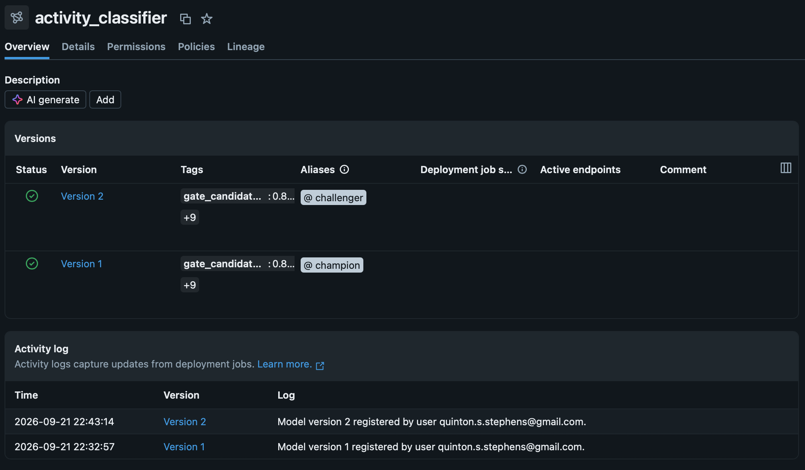
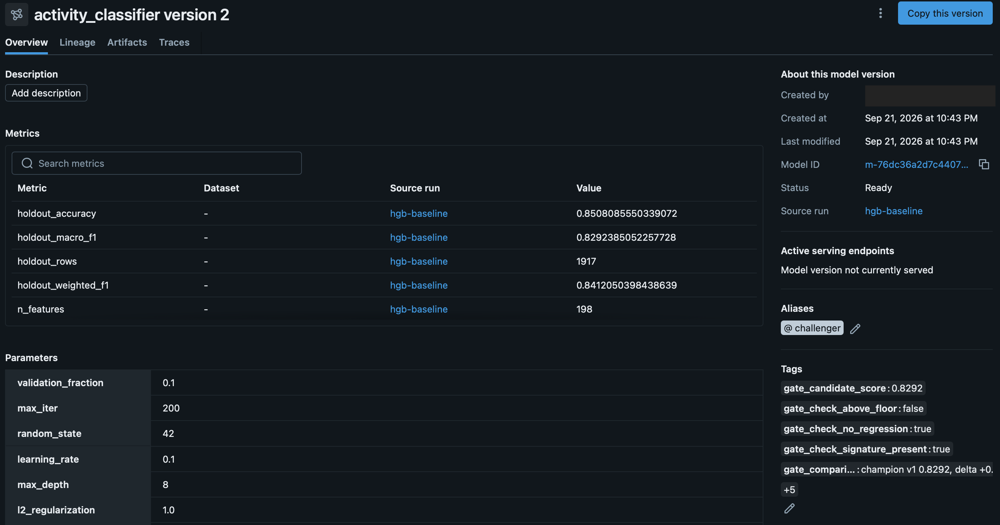
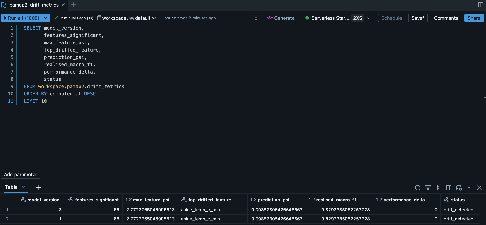
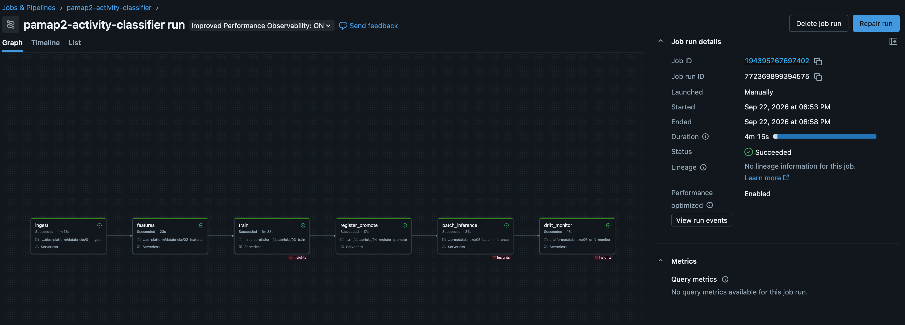

# Design: wearable activity classification platform

An end-to-end ML pipeline on Databricks and AWS, built to highlight the parts of
the machine learning lifecycle that are platform problems rather than modelling
problems: reproducibility, lineage, access control, promotion, and monitoring.

The model is deliberately simple. Every decision worth discussing is about the
system around it.

---

## Scope and split of responsibility

| Layer | Owner | What lives there |
|---|---|---|
| ML lifecycle | Databricks | Raw volume, Delta tables, features, MLflow tracking, Unity Catalog model registry, Jobs |
| Infrastructure | AWS, via Terraform | S3, IAM, OIDC federation, budgets, remote state |
| Delivery | GitHub Actions | Plan on pull request, branch protection |

I wasn't able to reach the account console on Free Edition, 
so the account UUID needed for a Unity Catalog storage 
credential wasn't available (data lives in a managed volume rather than
an external location on S3). The split above is the result of that
constraint: the ML lifecycle sits where the ML tooling is, 
and infrastructure, state and cost governance sit in AWS.

---

## Data

PAMAP2 Physical Activity Monitoring (Reiss and Stricker, UCI ML Repository,
CC BY 4.0). Nine subjects, eighteen activities, three inertial measurement units
at 100Hz plus a heart rate monitor at roughly 9Hz.

Chosen because it showcases the same capabilities a wearable platform has to handle: 
a physiological signal sampled at a different rate from the motion signal, genuine missing values, 
and multiple subjects, which is what makes honest evaluation and real drift possible.

### Pipeline

```
01_ingest          raw .dat  →  bronze_readings
02_features        bronze    →  gold_features
03_train           gold      →  MLflow run
04_register_promote run      →  registry version, gated
05_batch_inference champion  →  predictions
06_drift_monitor   predictions → drift_metrics
```

---

## Decisions

### Evaluation is split by subject, not by row

Rows inside a 5.12-second window are highly correlated. A random split would let 
the model memorise individuals rather than learn activities, and would produce a 
much higher number that means much less.

Subjects 101–106 train, 107–109 holdout. Realised macro F1 is **0.83**. The lower
number is the honest one, and it's the number the promotion gate enforces.

This choice also provides the drift monitor with a genuine population shift to
detect: different people, not injected noise.

### Macro F1, not accuracy

Class support ranges from 128 to 680 training windows. Accuracy rewards a model
that predicts common activities well and ignores rare ones. Macro F1 weights
every activity equally.

### Data contracts at each layer boundary

`01_ingest` and `02_features` each end in assertions that fail the task rather
than warn.

This exists because of a real failure found during development. The heart rate
null-rate check reported 0%, when the dataset's sampling rates imply roughly 90%.
The cause: **NaN is not null in Spark.** `isNull()` returns false for NaN, and
`last(ignorenulls=True)` skips nulls but not NaN. The source encodes missing
readings as NaN, so the forward-fill silently did nothing, every heart rate
aggregate returned NaN, and the gradient-boosted model (which tolerates NaN
natively) would have trained without heart rate and produced a plausible score.

Every stage reported success. The bug was caught by comparing a number against
what the source documentation said it should be.

The assertions now encode that expectation:

- bronze: heart rate null rate within 0.85–0.95; exactly nine subjects
- gold: heart rate and IMU feature null rates below 0.05 after forward-fill

A check that only prints is not a check once the pipeline is scheduled.

### Promotion is gated, and the gate is enforced by the system

`04_register_promote` registers the candidate and promotes it to `@champion`
only if all three hold:

1. **Model signature present.** UC requires one to register a model, and it 
gives the loader a declared input contract rather than an implicit one.
2. **Absolute floor.** Holdout macro F1 at or above 0.75, so a broken pipeline
   cannot promote a model merely because no champion exists yet.
3. **No regression.** Within 0.01 of the incumbent champion on the same holdout.

Aliases rather than stages: MLflow's Staging and Production stages are
deprecated under Unity Catalog. `@champion` is a movable pointer, so promotion
and rollback are the same operation in opposite directions, and consumers never
change code.

Every gate decision (pass or fail, with scores, thresholds and comparison) is
written onto the model version as tags. The registry is the audit trail.

A failed gate raises, which fails the job task. The rejected version is kept as
`@challenger`; the champion does not move.

**Verified by deliberate failure.** Raising the floor to 0.95 and re-running
produced exactly that: version registered, tagged `gate_passed=false`, aliased
`@challenger`, task failed with a stated reason, champion untouched.





### Inference loads by alias, and records lineage

`05_batch_inference` loads `models:/…@champion` rather than a version number, so
promotion propagates with no code change and rollback is moving the alias back.
Input columns come from the model's own signature rather than being re-derived,
giving one source of truth for what the model expects.

Every prediction row carries the model name, version and training run ID, and
the table appends rather than overwrites. Any prediction traces back to a
version, that version's gate decision, and the run that produced it.

### Monitoring distinguishes drift from degradation

Three measurements:

| Measure | Method | Result |
|---|---|---|
| Feature drift | PSI vs training distribution, decile bins | significant drift; largest on ankle temperature |
| Prediction drift | PSI over predicted class mix | within tolerance |
| Realised performance | macro F1 vs promoted score | within tolerance |



Only measured degradation raises. Drift alone warns. Inputs moving is a reason
to investigate, not evidence the model is wrong.

Ankle temperature showed the largest shift. That's plausible (skin temperature 
at a limb varies between people with body composition, peripheral circulation 
and sensor seating, more than accelerometer patterns for the same activity do) 
but it's one feature from one comparison, and I haven't tested it. 
The useful property is that the drift is real rather than injected: 
different people wearing the same sensors doing the same activities.

Realised performance is the measure that matters and the one production usually
can't have: labels arrive late or never. Feature and prediction drift exist as
early proxies for a degradation that cannot yet be measured. This dataset has
labels, so all three are computed. In this run they diverged: significant 
input drift with realised performance intact. One comparison isn't evidence 
about how well drift predicts degradation in general, but it is the concrete 
case for not paging on drift alone. In production the alerting logic inverts:
significant drift becomes actionable because performance is unknown.

### Orchestration

The six notebooks run as a Databricks job, one task each, in a linear dependency
chain. Every task halts the pipeline on failure.



The decision worth arguing about is what happens when the promotion gate
rejects a candidate. The champion is untouched, so batch inference could safely
continue on the existing model: an availability argument for letting scoring
proceed. The pipeline stops anyway: a rejected candidate is a human-attention
event, and if inference silently carries on, nobody investigates why training
stopped improving until weeks of failed gates have accumulated. Failing loudly
costs one batch of predictions and forces the investigation. In a system with
downstream consumers depending on daily scores, the opposite choice would be
defensible.

`performance_tolerance` is the one value exposed as a job parameter, read from a
notebook widget with a default so the notebook still runs standalone. It is the
threshold most likely to need tuning without a code change: the line between
what belongs to an operator and what belongs to an author.

### Delivery

A GitHub Actions workflow runs `fmt -check`, `init`, `validate` and `plan` on
any pull request touching `infra/`. Plan output is written to the run summary.
A branch ruleset requires that check before merging to `main`.

Apply remains human-initiated. The CI role deliberately cannot apply, so the
pipeline can tell you what would change but not change it.

This is the same argument as the promotion gate, one layer down: the procedure
is enforced by the system rather than by whoever remembers to run it.

---

## Environment-specific behaviour

Three things worked differently than documentation or local experience implied.
All three were found by running against the real environment rather than
assuming portability.

**Unity Catalog reserves `.` in model version tag keys.** The registry rejects 
them outright. I haven't tested the same keys against an open-source tracking server, 
but the restriction isn't in the MLflow API surface I was coding against: an argument 
for running the promotion gate against the real registry in CI rather than a local stand-in.

**Serverless compute blocks MLflow's automatic context tags.** MLflow resolves
notebook path and cluster metadata through a JVM call that serverless isolation
does not whitelist. It warns and continues; explicitly set tags are unaffected.
Automatic context collection is a convenience that fails quietly when the 
environment changes, so anything needed to answer "what produced this model" 
is set explicitly in the training run rather than inherited from the platform.

**AWS auto-populates the OIDC provider thumbprint.** Per AWS's documentation, 
thumbprints are no longer used to validate well-known identity providers. 
On the current Terraform provider version the attribute is optional, 
and omitting it produces a correctly populated value server-side 
(which is what I observed).

---

## Reproducibility

| Pinned | How |
|---|---|
| Code | Git; workspace runs from a Git folder, not manual imports |
| Runtime | Databricks serverless environment v5, recorded as PEP 723 inline metadata in every notebook |
| Providers | `.terraform.lock.hcl` committed, AWS provider `~> 6.0` |
| Data lineage | Training run tags record feature table, train and holdout subject IDs, and split strategy |
| Model contract | Signature and input example logged with every model |

---

## Access model

**Unity Catalog** governs data and models; the registry enforces the signature
contract at load.

**GitHub Actions to AWS** uses OIDC federation, no stored credentials. The trust
policy is scoped by `sub` so that only this repository can assume the role;
without that condition any GitHub repository could.

Getting that condition right required reading the token rather than the
documentation. The obvious pattern `repo:owner/name:*` never matched, and the
failure surfaced only as `Not authorized to perform sts:AssumeRoleWithWebIdentity`.
Every static check passed: the OIDC provider existed with the right client ID and
an auto-populated thumbprint, the audience condition was correct, the role ARN
resolved, the repository name matched case-for-case, and the runner had
`id-token: write`.

Decoding the actual token showed why:

```
sub: repo:qstephen18@132381688/mlops-wearables-platform@1378728679:pull_request
repository: qstephen18/mlops-wearables-platform
```

The `sub` claim carries immutable numeric IDs appended to both the owner and the
repository name. The `repository` claim does not, which is why every indirect
check looked correct. The condition now wildcards across those suffixes.

This is arguably stronger than name matching rather than a workaround: the IDs
are immutable, so a policy bound to them does not silently keep trusting an
account or repository name after a rename or transfer. The tightest version pins
the IDs exactly, at the cost of needing an update if the repository is recreated.

**The CI role can plan but not apply.** Broad read via `ReadOnlyAccess` because
`terraform plan` must read every managed resource to detect drift; write access
is narrow and scoped to the state prefix. Apply remains human-initiated.

**Local credentials** are an IAM access key on the workstation. Acceptable for a
single operator; long-lived keys in CI are how incidents start, which is why CI
federates instead.

---

## Cost controls

Tagging is applied at the Terraform provider level, so every resource carries
`Project`, `Owner`, `Environment` and `CostCenter` without anyone remembering to
tag by hand.

A monthly budget is defined in Terraform (the guardrail is version-controlled
rather than clicked) with alerts at 50/80/100% of actual and 100% of forecast.
Forecast is the one that warns before the money is gone. Cost anomaly detection
runs on top.

S3 versioning is enabled for reproducibility and paired with a 30-day
non-current expiry, because versioning without lifecycle is storage billed
forever.

Two operational notes. Cost Explorer must be explicitly enabled on a new account
before its API returns anything, and IAM users cannot read billing pages at all
until the root user grants IAM access to Billing and Cost Management (an
account-level setting no IAM policy can substitute for). Cost Explorer API calls
are also billed per request, while Budgets notifications are not, which makes
budgets the right mechanism for continuous guardrails and Cost Explorer the
right one for deliberate inspection.

---

## Known limitations

- **Subject 109 contributes 6,391 rows and one activity** — a documented property
  of the dataset. The holdout is effectively two subjects.
- **No external location.** Free Edition constraint; see Scope above.
- **`force_destroy` is enabled** on the platform bucket so teardown is one
  command. Correct for a lab, wrong anywhere the data matters.
- **Terraform state lives in the bucket it manages.** A destroy would delete
  state mid-operation. The fix is a separate bootstrap configuration that is
  never destroyed.
- **Single-region, single-account.** No environment separation.

## Next

- Pin the OIDC trust condition to the exact owner and repository IDs rather than
  wildcarding across them
- Databricks Asset Bundles deployed from CI via a service principal with OAuth
  M2M, replacing manual job definition
- Separate bootstrap state configuration
- Storage credential and external location managed through the Databricks
  Terraform provider, so both halves of the access path are in code
- Feature store rather than a gold table, for train/serve consistency
- Scheduled drift evaluation decoupled from the training run
